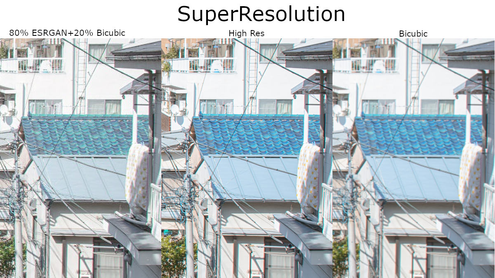

<div align="center">
    
</div>

SuperResolution is a super-resolution program that uses ESRGAN trained models. All ESRGAN models are trained using the [BasicSR](https://github.com/xinntao/BasicSR) github project then converted to TorchScript. This TorchScript model allows for libtorch inferencing. The goal of this project is to create a multi-platform and multi-targeted super-resolution program. 

Multi-targeted in that this program will have a model not just targeting general photography but also Anime, to super-sample old Animations, Faces, to super-sample low-res face images, and more in the future.

# Build

The hunter and cmake-based dependency build system automatically acquires and builds most depedencies for most platforms. Where the build differs is with the libtorch dependency. All builds require both cmake and libtorch to be previously installed.

## LibTorch

LibTorch is required for the model inferencing. Since LibTorch is less popular than PyTorch it lacks some more detailed documentation, but I have found [these](https://github.com/pytorch/pytorch/blob/master/docs/libtorch.rst) build instructions. Now, building libtorch is optional as binaries can be found on the pytorch.org site.

To build LibTorch Python and some python dependencies are also required.

```
conda install numpy pyyaml setuptools cffi typing_extensions future six requests dataclasses
```

Only install the Math Kernel Library (MKL) if you are using an intel system
```
conda install mkl mkl-include
```
Then to finally get, build, and install libtorch
```
git clone -b <version> --recursive https://github.com/pytorch/pytorch.git
cd pytorch
mkdir build
cd build
cmake -DBUILD_SHARED_LIBS=ON -DCMAKE_BUILD_TYPE=Release ..
make -j<build threads>
```
## This Project
Then to acquire and build this project:
```
git clone https://github.com/anhydrous99/SuperResolution
cd SuperResolution
mkdir build
cd build
cmake ..
make -j<build threads>
```
On Windows, I won't provide instructions for building libtorch as it is very finicky. To build the project you can simply download the release version of the libtorch library on the pytorch.org site then, after acquiring, moving to, and created the build folder.
```
cmake -DCMAKE_PREFIX_PATH=<path to libtorch> -DCMAKE_BUILD_TYPE=Release ..
cmake --build . --config Release
```

# Models

All models reside within the models folder. For model suggestions feel free to open an issue. Training a model takes about a week, after collecting a dataset, using the RTX 3080 I am using.

| FileName  | Target         | Scale |
|-----------|----------------|-------|
| G_4x.pth  | General Images | 4x    |
| A_4x.pth* | Anime          | 4x    |
| F_4x.pth* | Faces          | 4x    |

**Planned models*

# Usage

This is primarly terminal/command line program, might build a multi-platform GUI in the near future. Iteraction with the program primarily takes place in the form of command line arguments. 

```
SuperResolution [OPTION...]

-m, --model_path arg  The path to the TorchScript ESRGAN Model (default:
                    G_4x.pth)
-i, --input arg       The path to the input video or image
-o, --output arg      The path to the output video or image
    --side_dim arg    The out dimension size for model (default: 128)
    --scale arg       The upscale factor for model (default: 4)
-b, --batch_size arg  Number of blocks to batch_size (default: 1)
-w, --weight arg      Cubic Interpolation weight (between 0 and 100)
                    (default: 0)
-h, --help            Print Usage
```
 
 To perform super-resolution using the default model you can run:
 ```
 ./SuperResolution -i <input image or video path> -o <output image or video path>
 ```
 To blend, 25%, with the BiCubic interpolation method you can use the `--weight 25` argument. You can use the `-m` or `--model_path` argument to use a non-default model.
 If the model has a different input side length or scale then the default you can use the `--side_dim` and `--scale` arguments. 

 When built with CUDA, increasing the batch size might speed up calculation greatly. This can be changed with the `-b` or `--batch_size` arguments.
 